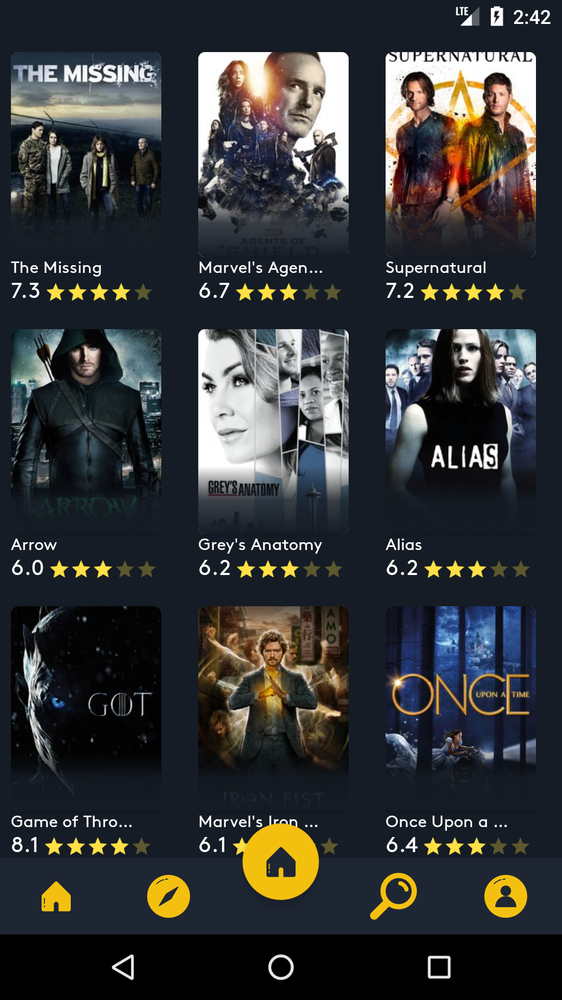

Plex-Design
======================

Material design icons is the official [icon set](https://www.google.com/design/spec/style/icons.html#icons-system-icons) from Google.  The icons are designed under the [material design guidelines](https://material.io/guidelines/).

### 3.0.1 Update

* Changed license in package.json.
* Added missing device symbol sprites.

### 3.0.0 Update

License change to Apache 2.0!

## Getting Started

Read the [developer guide](https://google.github.io/material-design-icons/) on how to use the material design icons in your project.

## Screenshots

